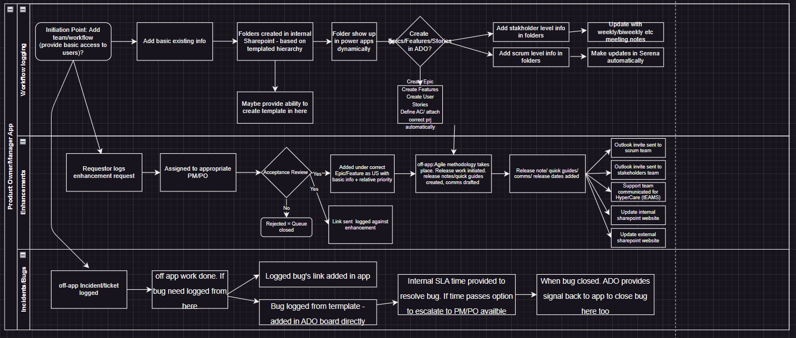

# Product Owner / Product Manager App

### Need of the App/Automation
Right now a lot of the crucial but rote tasks are being done manually. This includes but is not limited to
1. Disucssing potential feature enahcnements with multiple stakeholders on weekly calls 
    1. Current work around: Having to write it down in a meeting notes journal. Then go back to discuss internally the requirements and if accepted jot it down in user story, otherwise let the stakeholders know that the request is rejected. 
    2. Possible Solution: Automate the acceptance/rejection process and automatically add details to a user story or send out an email rejection with details.
2. Keeping track of applications/workflows basic info i.e. POC, stakeholders, release date/notes, technical guides,  Any enhancements asked for this (from whom)
    1. Current Solution: Disjointed use of confluence/OneNote/Sharepoint for all this information
    2. Possible Solution: Automate all the information gathering and update one main site/wiki.
3. Setting release date. Updating release notes quick guides, technical guides, and drafting communication to cusomters. Uploading/Sending these manually to correct sites or clients.
    1. Current Solution: All of this is done manually. on Word, Outlook and Excel
    2. Possible Solution: Use excel to set dates and DLs/email addresses of users. Create guides and comms in Word and add them in specific folder. Once either is updated an automate flow is triggered and the correct websites are updated and comms are sent out at the correct dates to users.
4. Updating internal development team & support team for HyperCare
    1. Current Solution: Email and Teams is used dijointedly
    2. Possible Solution: Same excel file & automation from 3.2 is used to automatically update Release Channel on teams that the dates have been set and if HyperCare is needed or not.

### Workflow of the different components of the app:

Step 1: Automate flows in Power Automate with eixsting tools (Word, Excel, Forms Outlook etc)

Step 2: Create Power App and integrate the automation for a holistic product